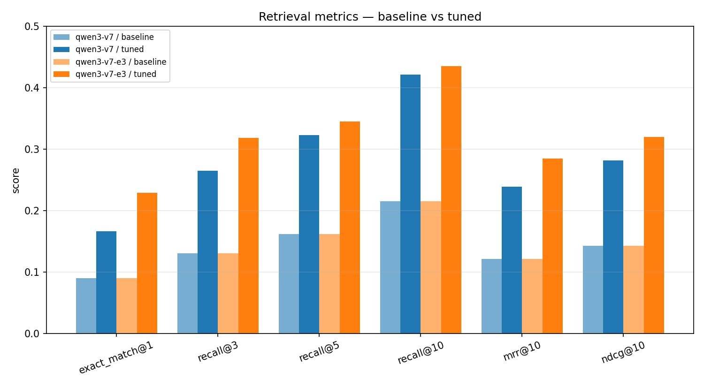
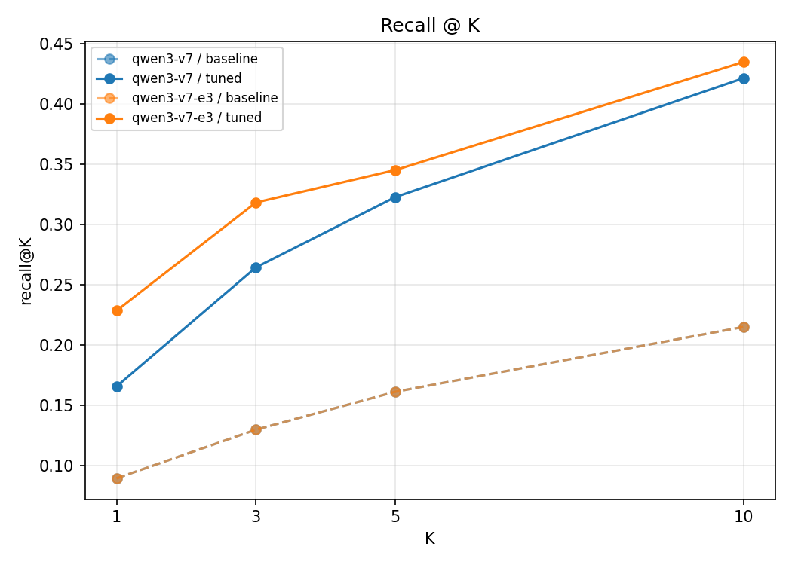

# GraphQL Semantic Introspection Field Retrieval

Field-coordinate-first pipeline for training an embedding model to map natural-language capability requests to GraphQL schema coordinates such as `Post.author` or `Query.userByEmail`.

## Results

Fine-tuned `Qwen/Qwen3-Embedding-0.6B` (v7 dataset, 3 epochs) vs base, on 223 held-out queries:

| metric        | base  | tuned  |
|---------------|-------|--------|
| exact_match@1 | 0.090 | **0.229** |
| recall@5      | 0.161 | **0.345** |
| recall@10     | 0.215 | **0.435** |

2.5× top-1 accuracy, 2× recall@5/10.




The lift concentrates on queries where the user names a concept rather than a field — e.g. *"what commitments have we made about response times?"* → `SlaPolicy.description`. Base model ranks it **101st**; fine-tune ranks it **1st**.

Full writeup: **[docs/training-results.md](docs/training-results.md)**.

## Goal

This project trains the retrieval component for semantic introspection `__search`.

The embedder does one job:
- rank the most relevant `Owner.field` coordinate for a natural-language query

It does not do these jobs:
- compute `pathsToRoot`
- build the final GraphQL operation
- plan multi-step query execution

Those belong downstream in the MCP / semantic-introspection server.

## Why Field Retrieval

Type retrieval is too coarse for the actual product problem.

If the user asks:
- `Who wrote the post?`

The target is:
- `Post.author`

A confuser like:
- `User.name`

is semantically close but still wrong. The retrieval system therefore needs exact coordinate recall, not just “some related type”.

## Core Approach

- Build field-level corpora from GraphQL schemas and synthetic schema worlds
- Represent each document as a schema coordinate plus multiple retrieval views:
  - `coordinate`
  - `signature`
  - `semantic`
  - `sdl`
- Generate training data as `anchor -> positive_coordinate -> ranked hard negatives`
- Train with `CachedMultipleNegativesRankingLoss` (listwise InfoNCE over in-batch + explicit hard negatives) — this matches the product metric `exact_match@1` much more closely than a triplet margin
- Sample the positive view stochastically each epoch across `coordinate / signature / semantic / sdl` so the model cannot collapse onto one surface form
- Prefer hard confusers over trivial augmentation
- Split by schema world so held-out evaluation measures transfer to unseen schemas
- Apply stem-level leakage filtering on val/test so positives are not solvable by lexical overlap
- Gate results on a curated challenge eval designed for realistic ambiguity

## Dataset Philosophy

A good dataset here has these properties:
- schema-name blindness: user phrasing should not include canonical schema names
- exact targets: one best coordinate, not just a rough type neighborhood
- explicit confusers: same owner / wrong field, same field name / wrong owner, same return type / wrong semantics
- held-out schemas: validation and test should use unseen worlds
- curated final eval: release decisions should not rely only on synthetic holdouts

## Data Format

Training rows are field-first:

```json
{
  "query": "Who wrote the post?",
  "positive_coordinate": "Post.author",
  "negative_coordinates": ["User.name", "Post.authorId"],
  "owner_type": "Post",
  "field_name": "author",
  "intent": "authorship",
  "confuser_tags": ["same_owner", "semantic"]
}
```

Corpus rows store field-level views:
- `coordinate_text`
- `field_signature_text`
- `field_semantic_text`
- `sdl_snippet_text`
- `retrieval_text`

## Training Objective

The trainer targets the product metric directly: given a natural-language anchor, rank the correct coordinate ahead of *every* other coordinate, not just one random confuser.

Loss: `CachedMultipleNegativesRankingLoss` (InfoNCE with in-batch negatives). Each training row is materialized as:

```
(anchor, positive, negative_1, ..., negative_N)
```

- `positive` is sampled stochastically each epoch from the configured `positive_views` (`coordinate / signature / semantic / sdl`). This prevents collapse onto one surface form and multiplies the effective training signal without cartesian explosion of the dataset.
- `negative_1..N` are the top-ranked mined confusers from the dataset builder (same-owner, same-field-name, same-return-type, semantic). When fewer than `N` mined negatives exist for a row, the remainder are backfilled with random in-corpus coordinates outside `relevant_coordinates`.
- At loss time each row contributes `1 + N` explicit pairs plus `batch_size - 1` in-batch negatives, so every step optimizes a softmax over roughly `batch_size × (1 + N)` candidates.
- `cached_mnrl` lets you keep a large effective contrastive batch without OOM by chunking the similarity matrix across mini batches (`--mnrl-mini-batch-size`).

The legacy `triplet` loss is still available via `--loss triplet` for ablations.

Training precision auto-selects `bf16` on recent CUDA, falls back to `fp16`, then `fp32`. Override with `--precision`.

## Metrics

Primary metrics:
- `exact_match@1` — top-1 is in the relevant-coordinate set (counts ambiguous-positive rows correctly)
- `recall@1/3/5/10` — against the canonical positive coordinate
- `set_recall@5/10` — any member of `relevant_coordinates` appears in top-k
- `coverage@5/10` — fraction of `relevant_coordinates` retrieved in top-k (ambiguity-aware)
- `mrr@10`, `ndcg@10`
- `same_owner_wrong_field_rate@1` — the characteristic failure mode for GraphQL retrieval
- `ambiguity_rate` — share of rows with more than one valid coordinate, reported per benchmark
- Slice metrics break down by `intent`, `difficulty`, `confuser_tag`, and `ambiguity:single_relevant` vs `ambiguity:multi_relevant`

Benchmark sets:
- `realism_eval`
- `adversarial_eval`
- `synthetic_holdout`
- `curated_challenge_eval`

`curated_challenge_eval` is the release gate.

## Install

```bash
python3 -m venv .venv
source .venv/bin/activate
python -m pip install -e '.[dev,wandb]'
```

## Environment

```bash
OPENAI_API_KEY=...
WANDB_API_KEY=...
```

## Production workflow

The production workflow mixes synthetic worlds with one or more real GraphQL schemas, generates phrasing-diverse OpenAI queries per target, validates the dataset with a sanity report, trains with listwise MNRL + prompt-aware encoding, and gates releases on a hand-curated realism benchmark.

```bash
# 0. Drop your target schema(s) into schemas/real/
#    (.graphql SDL or introspection .json).
#    Starter set of four open-source schemas is already checked in:
#    GitHub Enterprise Server, Saleor, Shopify Storefront, AniList.
#    See schemas/real/README.md for sources and provenance.
mkdir -p schemas/real
# optionally add your own: cp ~/path/to/target.graphql schemas/real/

# 1. Generate seed queries against synthetic worlds + real schemas.
#    Fails loudly if OPENAI_API_KEY is missing (no silent local fallback).
export OPENAI_API_KEY=sk-...
graphft generate-openai-seed \
  --out-dir artifacts \
  --version 1 \
  --config examples/pipeline_config.yaml \
  --real-schemas-dir schemas/real \
  --phrasings-per-target 4

# 2. Build dataset. Per-stage sanity report is written to
#    artifacts/datasets/v1/sanity_report.json; eyeball
#    sanity_sample.jsonl before you burn GPU.
graphft build-dataset \
  --corpus artifacts/corpus/types_worlds_v1.jsonl \
  --openai-seed artifacts/openai/seed_pairs_v1.jsonl \
  --out-dir artifacts \
  --version 1 \
  --config examples/pipeline_config.yaml

# 3. Merge your hand-written release-gate benchmark. Write ≥100 rows
#    by hand against your real schema - the best ROI in the pipeline.
#    See examples/curated_realism_eval.template.jsonl for the format.
graphft merge-curated-benchmark \
  --curated path/to/my_curated.jsonl \
  --corpus artifacts/datasets/v1/corpus.jsonl \
  --dataset-dir artifacts/datasets/v1

# 4. Train with CachedMultipleNegativesRankingLoss + prompt-aware encoding.
graphft train-embedder \
  --train artifacts/datasets/v1/train.jsonl \
  --val artifacts/datasets/v1/val.jsonl \
  --corpus artifacts/datasets/v1/corpus.jsonl \
  --positive-views coordinate,signature,semantic,sdl \
  --primary-retrieval-view semantic \
  --loss cached_mnrl \
  --num-hard-negatives 4 \
  --mnrl-scale 20 \
  --mnrl-mini-batch-size 16 \
  --precision auto \
  --eval-every-epoch \
  --benchmark-dir artifacts/datasets/v1/benchmarks \
  --best-metric ndcg@10 \
  --best-benchmark curated_realism_eval \
  --out-dir artifacts/models/qwen3-field-embedding-ft

# 5. Evaluate head-to-head against the base Qwen3 on the held-out test set,
#    then across every benchmark suite (realism / adversarial / ambiguity /
#    real_schema / curated_realism).
graphft eval-retrieval \
  --eval-set artifacts/datasets/v1/test.jsonl \
  --corpus artifacts/datasets/v1/corpus.jsonl \
  --base-model Qwen/Qwen3-Embedding-0.6B \
  --tuned-model artifacts/models/qwen3-field-embedding-ft \
  --retrieval-view semantic \
  --out-dir artifacts/eval/v1

graphft run-benchmark \
  --benchmark-dir artifacts/datasets/v1/benchmarks \
  --corpus artifacts/datasets/v1/corpus.jsonl \
  --model artifacts/models/qwen3-field-embedding-ft \
  --retrieval-view semantic \
  --out-dir artifacts/eval/benchmarks_v1
```

The release gate is `curated_realism_eval` on `exact_match@1` and `ndcg@10`, with `real_schema_eval` as the cross-check that transfer to live GraphQL actually happened. Synthetic-holdout metrics are informative but not decision-making.

### Benchmark suite reference

| Suite | What it measures | Gate? |
|---|---|---|
| `synthetic_holdout` | Test-split rows on unseen synthetic worlds | no |
| `realism_eval` | Plain/ellipsis/multi-clause test rows (leakage still filtered upstream) | no |
| `adversarial_eval` | Sibling-confuser / root-vs-nested rows | yes (regression watch) |
| `ambiguity_eval` | Rows with ≥2 valid coordinates (`coverage@k`, `set_recall@k`) | yes |
| `real_schema_eval` | Test rows tied to ingested real SDLs | yes |
| `curated_realism_eval` | Hand-written queries against your real schema | **release gate** |
| `curated_challenge_eval` | Templated curated adversarial queries | no (sanity only) |

## Architecture Boundary

The intended downstream flow is:
1. Retriever ranks schema coordinates.
2. Graph/path logic computes `pathsToRoot` for the selected coordinate.
3. Query planner constructs the executable GraphQL operation.

This repo only covers step 1. The tuned model artifact is consumed by [graphql-mcp-server](graphql-mcp-server/) which serves `list_types` / `run_query` over an embedding index built from the same `coordinate / signature / semantic / sdl` views this pipeline emits. Point the MCP server's `GRAPHQL_EMBED_MODEL` at the local `artifacts/models/qwen3-field-embedding-ft` directory (or a served endpoint hosting it) and reindex — the per-field search text it indexes must match the `retrieval_view` the model was tuned on (default `semantic`).
