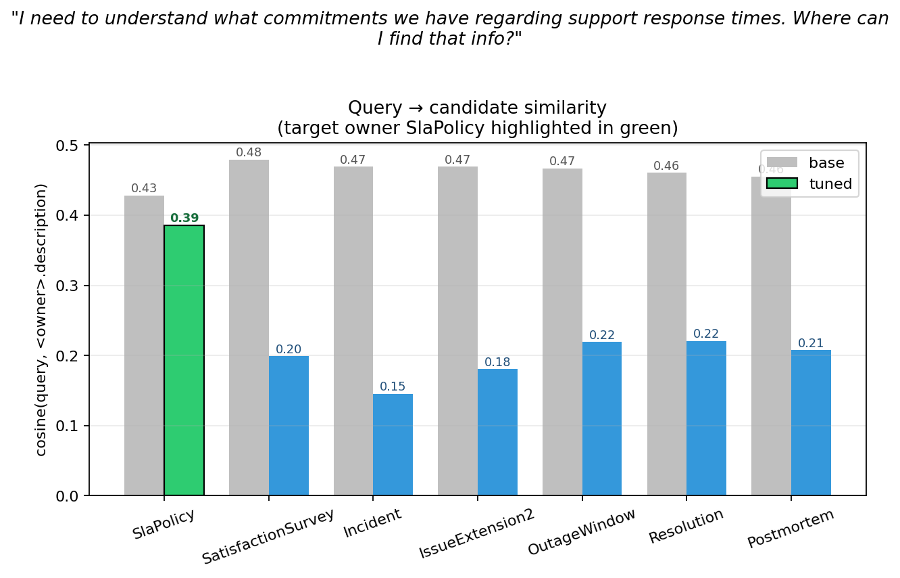
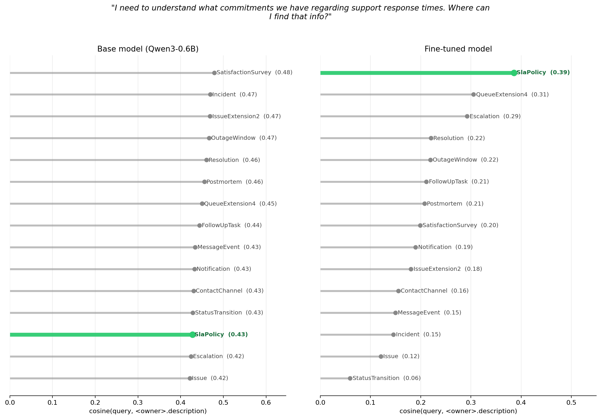
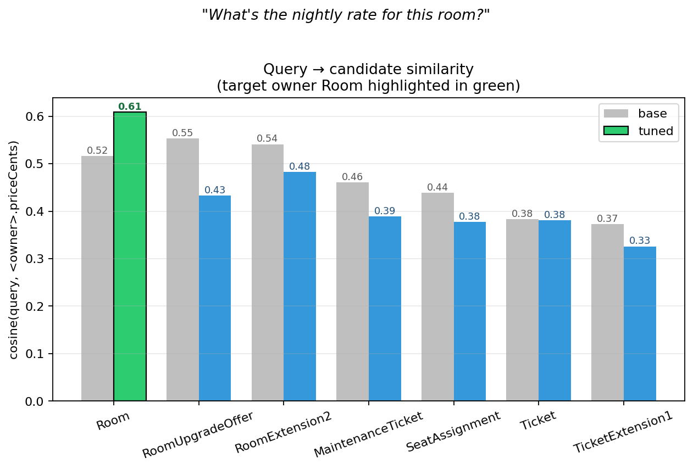
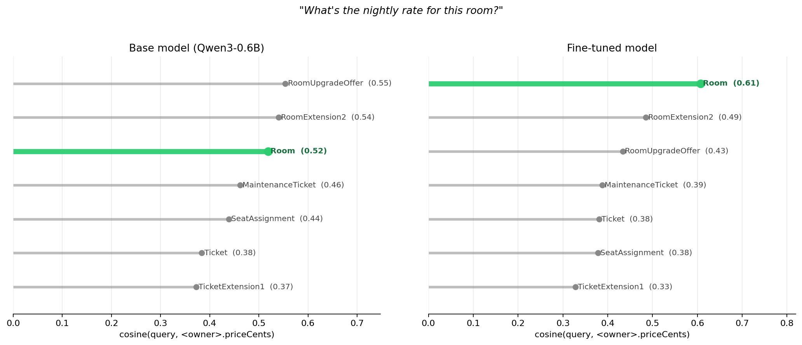

# Training results

Fine-tuning `Qwen/Qwen3-Embedding-0.6B` on the v7 dataset to map natural-language questions to GraphQL field coordinates (`Type.field`), with training signal focused on owner-type disambiguation across cross-type field-name collisions (e.g. `Issue.author` vs `PullRequest.author`).

## Metrics

223 held-out test queries, 28,893-coordinate corpus, 30% real SDLs (GitHub GHES, Saleor, Shopify, AniList) never seen in training.

| metric          | baseline | tuned (3 epochs) | lift           |
|-----------------|----------|------------------|----------------|
| exact_match@1   | 0.090    | **0.229**        | +0.139 (+155%) |
| recall@3        | 0.130    | **0.318**        | +0.188         |
| recall@5        | 0.161    | **0.345**        | +0.184 (+114%) |
| recall@10       | 0.215    | **0.435**        | +0.220 (+102%) |
| mrr@10          | 0.121    | **0.285**        | +0.164         |
| ndcg@10         | 0.143    | **0.320**        | +0.177         |


## Where the lift comes from

The improvement is concentrated on queries where the user names a concept rather than a field. Direct questions (*"has my package shipped?"*, *"what's my total?"*) are already handled well by the base model. Indirect questions ("what commitments have we made about response times?") require owner-type reasoning — and that's where the base model falls behind.

### Example: rank 101 → 1

> *"I need to understand what commitments we have regarding support response times. Where can I find that info?"*

Correct target: `SlaPolicy.description`. The schema has **262 `.description` fields** (on `Incident`, `Issue`, `Resolution`, `SatisfactionSurvey`, …). The retrieval task is picking the right owner — not the right field name.



|                                          | base    | tuned   |
|------------------------------------------|---------|---------|
| rank in full corpus (18,396 coordinates) | **101** | **1**   |
| rank among 262 `.description` siblings   | **12**  | **1**   |
| cosine(query, target)                    | 0.428   | 0.383   |
| cosine(query, base top-1 distractor)     | 0.484   | 0.303   |

The base model ranks `SatisfactionSurvey.description` and `Incident.description` above the target. The fine-tune demotes them — every wrong owner drops to 0.15–0.22 while the target becomes the top hit.



### Example: rank 5 → 1

> *"What's the nightly rate for this room?"*

Correct target: `Room.priceCents`. Six other `.priceCents` fields exist (upgrade offers, extensions, tickets).



|                                          | base                       | tuned   |
|------------------------------------------|----------------------------|---------|
| rank in full corpus                      | **5**                      | **1**   |
| rank among 7 `.priceCents` siblings      | **3**                      | **1**   |
| cosine(query, target)                    | 0.51                       | **0.61**|
| cosine(query, base top-1 distractor)     | 0.55 (`RoomUpgradeOffer`)  | 0.43    |
| margin to runner-up                      | –0.04 (target loses)       | +0.12   |

Even on a natural, direct question the base model picks the wrong owner (it ranks `RoomUpgradeOffer.priceCents` first). The fine-tune reverses the ordering and opens a clear margin.



## Run configurations

| run           | epochs | batch | lr   | loss        | wall time |
|---------------|--------|-------|------|-------------|-----------|
| `qwen3-v7`     | 2      | 64    | 5e-5 | cached_mnrl | ~11 min   |
| `qwen3-v7-e3`  | 3      | 64    | 5e-5 | cached_mnrl | ~16 min   |

Both: `--max-seq-length 256`, `--num-hard-negatives 4`, `--precision bf16`, full fine-tune (no LoRA), single H100.


## Known failure

`same_owner_wrong_field_rate@1` rose from 0.063 → 0.103. The model picks the right owner type more often but occasionally lands on the wrong field within the correct type. v7 training signal is tuned for owner disambiguation; field disambiguation within an owner isn't rewarded. Next iteration should add competition sets that share owner and differ by field.

## Dataset

| split   | rows   |
|---------|--------|
| train   | 4,788  |
| val     | 94     |
| test    | 223    |
| corpus  | 28,893 |

Built from `seed_pairs_v7.jsonl` (7,626 raw rows) via world-leakage, per-row strict-leakage, and family-level semantic dedup filters. Val/test shrink to ~20% of raw — the strict-leakage filter is aggressive on real-SDL queries.

## Reproducing

Train, evaluate, and re-render the plots from the committed dataset + model artifacts:

```bash
# Train (requires CUDA GPU; ~16 min on H100)
graphft train-embedder \
  --train artifacts/datasets/v7/train.jsonl \
  --val artifacts/datasets/v7/val.jsonl \
  --corpus artifacts/datasets/v7/corpus.jsonl \
  --model Qwen/Qwen3-Embedding-0.6B \
  --epochs 3 --batch-size 64 --max-seq-length 256 --learning-rate 5e-5 \
  --disable-lora --precision bf16 \
  --positive-views coordinate,signature,semantic,sdl \
  --primary-retrieval-view semantic \
  --loss cached_mnrl --num-hard-negatives 4 --mnrl-scale 20 --mnrl-mini-batch-size 16 \
  --eval-every-epoch --benchmark-dir artifacts/datasets/v7/benchmarks \
  --best-metric exact_match@1 --best-benchmark curated_challenge_eval \
  --out-dir artifacts/models/qwen3-v7-h100-e3

# Evaluate
graphft eval-retrieval \
  --eval-set artifacts/datasets/v7/test.jsonl --split test \
  --corpus artifacts/datasets/v7/corpus.jsonl \
  --base-model Qwen/Qwen3-Embedding-0.6B \
  --tuned-model artifacts/models/qwen3-v7-h100-e3/best \
  --retrieval-view semantic \
  --out-dir artifacts/evals/qwen3-v7-e3

# Regenerate aggregate plots
python tools/plot_eval.py artifacts/evals/qwen3-v7 artifacts/evals/qwen3-v7-e3 --out docs/images

# Regenerate per-query example plots (SLA)
python tools/demo_visualize.py \
  --base-model Qwen/Qwen3-Embedding-0.6B \
  --tuned-model artifacts/models/qwen3-v7-h100-e3/best \
  --corpus artifacts/datasets/v7/corpus.jsonl \
  --query "I need to understand what commitments we have regarding support response times. Where can I find that info?" \
  --target SlaPolicy.description \
  --out-dir docs/images

python tools/demo_ladder.py \
  --base-model Qwen/Qwen3-Embedding-0.6B \
  --tuned-model artifacts/models/qwen3-v7-h100-e3/best \
  --corpus artifacts/datasets/v7/corpus.jsonl \
  --query "I need to understand what commitments we have regarding support response times. Where can I find that info?" \
  --target SlaPolicy.description \
  --out docs/images/ranking_ladder_sla.png
```
